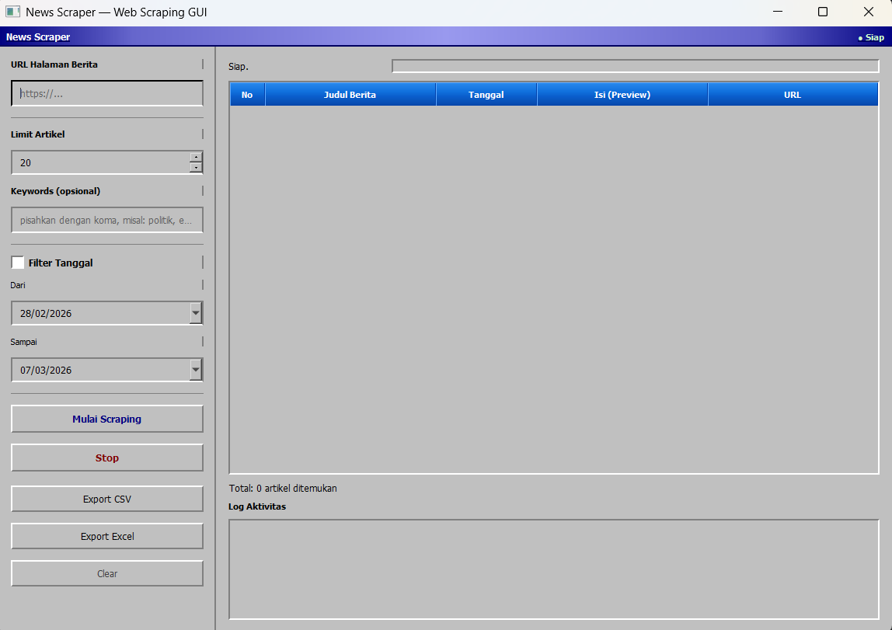
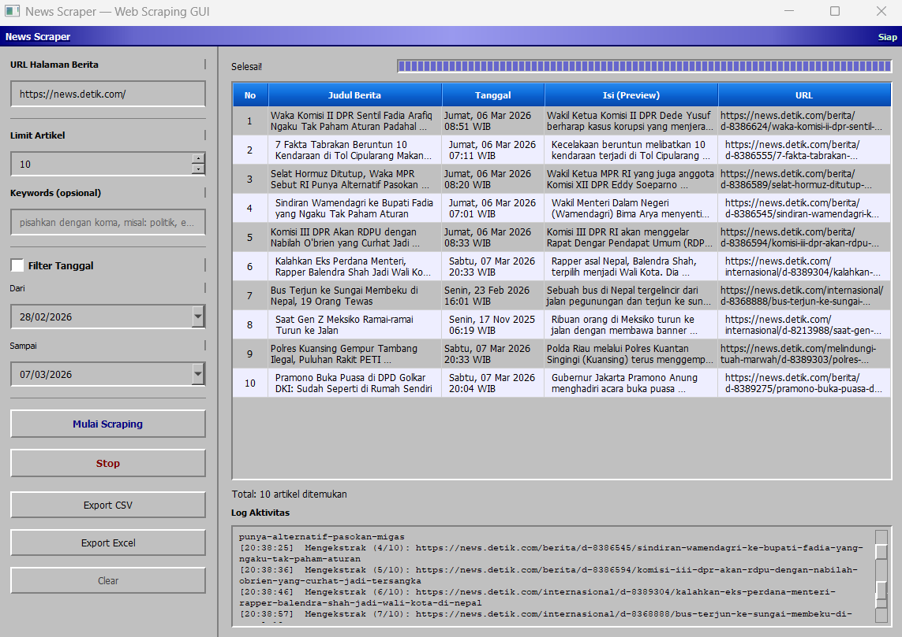

# 📰 News Scraper Application

## 📖 Deskripsi
News Scraper adalah aplikasi desktop berbasis antarmuka grafis (GUI) yang dirancang untuk mengekstrak data artikel dari berbagai portal berita secara otomatis. Aplikasi ini dibangun menggunakan **Python**, antarmuka **PyQt5**, dan mesin *scraping* dinamis berbasis **Selenium WebDriver**. 

Aplikasi ini mengimplementasikan arsitektur *asynchronous* (menggunakan `QThread`), sehingga antarmuka tetap responsif dan bebas *freeze* saat proses pengambilan data yang berat sedang berlangsung di latar belakang. Algoritma ekstraksi pada aplikasi ini telah **teruji dan dioptimalkan secara khusus** untuk beroperasi pada struktur HTML dari tiga portal berita utama:
* ✅ **CNN Indonesia**
* ✅ **BBC News Indonesia**
* ✅ **Detik.com**

Sistem juga dilengkapi dengan *fallback* general untuk mencoba mengambil data dari situs berita lainnya, meskipun akurasi penargetan elemennya akan bervariasi.

---

## 📸 Preview Tampilan
### Clean Preview

### Preview Hasil 
 

---

## ✨ Fitur Utama
* **Dukungan GUI Penuh:** Antarmuka yang ramah pengguna untuk mengatur parameter *scraping* tanpa perlu menyentuh kode.
* **Non-Blocking UI:** Implementasi *threading* memastikan aplikasi tidak *Not Responding* selama proses berjalan.
* **Anti-Bot Evasion:** Dilengkapi dengan jeda dinamis (*randomized delay*) antar-permintaan untuk mensimulasikan interaksi manusia dan menghindari pemblokiran server target.
* **Filter Pintar:** Menyaring hasil berdasarkan kata kunci (keywords) spesifik secara *real-time*.
* **Ekspor Data:** Kemampuan mengekspor hasil ekstraksi (Judul, Tanggal, Isi, URL) ke format **CSV** dan **Excel (.xlsx)** lengkap dengan *styling* kolom agar mudah dibaca.

---

## ⚙️ Prasyarat (Prerequisites)
Pastikan sistem Anda sudah terinstal perangkat lunak berikut sebelum menjalankan aplikasi:
1. **Python 3.8** atau versi yang lebih baru.
2. **Google Chrome** (karena Selenium dikonfigurasi menggunakan ChromeDriver bawaan).

---

## 🚀 Panduan Instalasi & Penggunaan

### 1. Instalasi Dependensi
Clone atau unduh repositori ini ke komputer Anda. Buka terminal/Command Prompt, arahkan ke direktori proyek, lalu jalankan perintah berikut untuk menginstal semua pustaka yang dibutuhkan:

```bash
pip install -r requirements.txt
```
### 2. Menjalankan Aplikasi
Setelah instalasi selesai, jalankan file utama penentu aplikasi (entry point):

```Bash
python main.py
```
### 3. Cara Penggunaan
* **Masukkan URL:** Ketik atau paste tautan halaman beranda atau halaman kategori berita (misal: https://www.cnnindonesia.com/teknologi).

* **Atur Limit:** Tentukan jumlah maksimal artikel yang ingin diekstrak untuk membatasi durasi proses.

* **Kata Kunci (Opsional):** Masukkan kata kunci jika Anda hanya ingin mengambil berita dengan topik tertentu (pisahkan dengan koma).

* **Mulai Scraping:** Klik tombol "Mulai Scraping". Anda dapat melihat proses berjalan pada progress bar dan log aktivitas di bagian bawah layar.

* **Ekspor Data:** Setelah proses selesai dan tabel terisi, klik tombol "Export CSV" atau "Export Excel" untuk menyimpan hasil ekstraksi ke penyimpanan lokal Anda.
